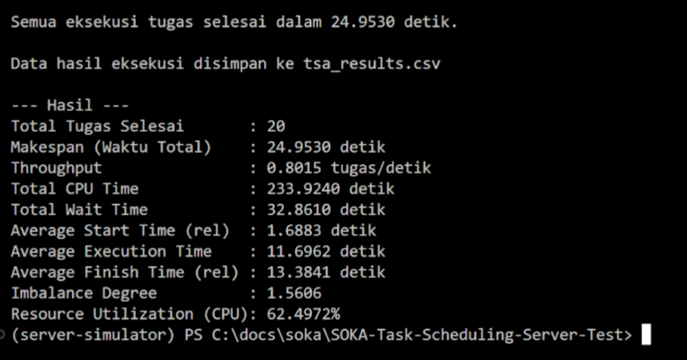
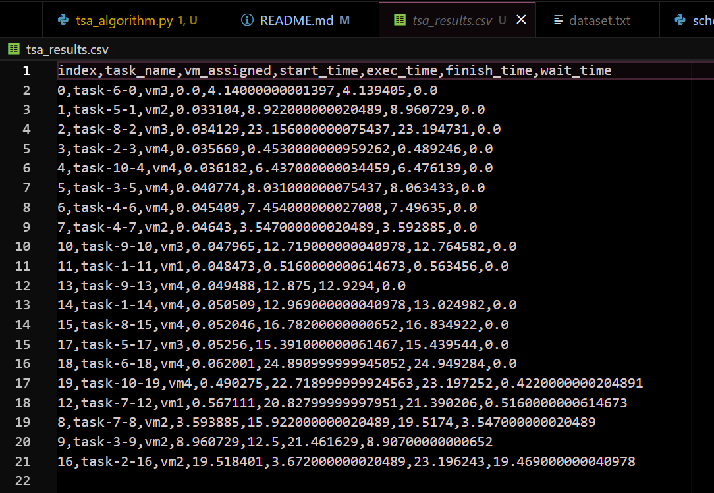

# Pengujian Algoritma Task Scheduler pada Server IT
## Kelompok G - SOKA A

| Nama |  NRP |
| --------- | -------- |
| Chelsea Vania H | 5027231003 |
| Salsabila Rahmah | 5027231005 |
| Farida Qurrotu A'yuna | 5027231015 |
| Nayyara Ashila | 5027231083 |

## Daftar Isi
[Laporan Pengujian](#laporan-pengujian)
 - [Analisis Kode](#analisis-kode)
 - [Analisis Kinerja](#analisis-kinerja) <br>

[Cara Menjalankan](#cara-penggunaan---dev)<br>
[Kesimpulan](#kesimpulan)

## Laporan Pengujian

Task scheduling adalah proses menentukan task mana yang dijalankan pada VM mana untuk meminimalkan waktu penyelesaian total (makespan), menyeimbangkan pemakaian resource, dan meningkatkan throughput sistem.

Pada proyek ini digunakan Tunicata Swarm Algorithm (TSA) yang digabung dengan Random Forest (RF) untuk meningkatkan proses eksplorasi dan prediksi kualitas solusi. Kombinasi ini disebut TSA-RF.

### Analisis Kode
1. Pembentukan Populasi Awal
```py
population = []
for _ in range(population_size):
    sol = {t_id: random.choice(vm_names) for t_id in task_ids}
    population.append(sol)
```
- Membuat populasi awal berisi sejumlah solusi acak.
- Setiap solusi merupakan pemetaan task → VM.
- Tujuannya menghasilkan keragaman solusi sebagai titik awal TSA.

2. Perhitungan Makespan
```py
estimated_time = task.cpu_load / vm.cpu_cores
vm_loads[vm_name] += estimated_time
return max(vm_loads.values())
```
- Menghitung waktu eksekusi task berdasarkan beban CPU dan jumlah core VM.
- Menjumlahkan waktu setiap task pada VM masing-masing.
- Mengambil waktu VM terlama sebagai makespan (cost).
- Semakin kecil makespan → solusi semakin optimal.

3. RF Training
```py
rf = RandomForestRegressor(n_estimators=80)
rf.fit(samples, costs)
```
- RF dilatih menggunakan encoding solusi dan nilai makespan-nya.
- Berfungsi sebagai model prediktif untuk memperkirakan kualitas solusi baru.
- Mempercepat proses TSA dengan mengurangi evaluasi cost yang mahal.

4. Mekanisme TSA
```py
if random.random() < 0.7:
    new_sol[t_id] = best_solution[t_id]
else:
    new_sol[t_id] = random.choice(vm_names)
```
- 70%: task mengikuti konfigurasi solusi terbaik (exploitation).
- 30%: task dipetakan ke VM acak untuk eksplorasi.
- Kombinasi ini meniru pola pergerakan tunicate (TSA).

5. Seleksi solusi
```py
if real_cost < costs[i]:
    population[i] = new_sol
    costs[i] = real_cost
```
`real_cost` = makespan sebenarnya dari solusi baru
Jika lebih baik daripada `costs[i]` :
- Solusi lama diganti
- Cost diperbarui

### Analisis Kinerja
**Ringkasan Hasil Eksekusi**


**Interpretasi**
1. Makespan (24.9530 detik)<br>
Waktu total untuk menyelesaikan semua task.
Nilai ini cukup baik, menunjukkan beban terschedule relatif efisien.

2. Throughput (0.8015 tugas/detik)<br>
Rata-rata hampir 1 task per detik.

3. Total CPU Time (233.9240 detik) <br>
Akumulasi seluruh waktu eksekusi task.

4. Total Wait Time (32.8610 detik)<br>
Waktu antrian sebelum dieksekusi.
Menunjukkan sistem tidak terlalu padat.

5. Imbalance Degree (1.5606)<br>
Mengukur keseimbangan beban antar VM:
```
< 2 → cukup seimbang
Jika > 3 → buruk
```
Artinya TSA-RF mampu menyeimbangkan load dengan cukup baik.

6. Resource Utilization (62.4972%) <br>
Tingkat pemakaian CPU keseluruhan.
```
60% → efisien
85% → sangat padat (risiko overload)
```
Dengan 62%, beban sistem masih aman.

## Cara Penggunaan - Dev

1. Install `uv` sebagai dependency manager. Lihat [link berikut](https://docs.astral.sh/uv/getting-started/installation/)

2. Install semua requirement

```bash
uv sync
```

3. Buat file `.env` kemudian isi menggunakan variabel pada `.env.example`. Isi nilai setiap variabel sesuai kebutuhan

```conf
VM1_IP="10.15.42.77"
VM2_IP="10.15.42.78"
VM3_IP="10.15.42.79"
VM4_IP="10.15.42.80"

VM_PORT=5000
```

4. Algoritma menggunakan `Tunicate Swarm Algorithm - Random Forest (TSA-RF)`

5. Untuk menjalankan server, jalankan docker

```bash
docker compose build --no-cache
docker compose up -d
```

6. Inisiasi Dataset untuk scheduler. Buat file `dataset.txt` kemudian isi dengan dataset berupa angka 1 - 10. Berikut adalah contohnya:

```txt
6
5
8
2
10
3
4
4
7
3
9
1
7
9
1
8
2
5
6
10
```

7. Untuk menjalankan scheduler, jalankan file `scheduler.py`. **Jangan lupa menggunakan VPN / Wifi ITS**

```bash
uv run scheduler.py
```

8. Apabila sukses, akan terdapat hasil berupa file `tsa_result.csv` dan pada console akan tampil perhitungan parameter untuk kebutuhan analisis.

`tsa_result.csv`


`console`


## Kesimpulan
**TSA-RF terbukti efektif untuk task scheduling.** Dengan perpaduan eksplorasi TSA dan prediksi RF, diperoleh:
- Makespan rendah (24.95 detik)
- Beban cukup seimbang (imbalance degree 1.56)
- Resource utilization optimal (62%)
- Paralelisme eksekusi tinggi

**RF membantu TSA melakukan eksplorasi lebih terarah.**
RF membantu menghindari eksplorasi solusi buruk, sehingga iterasi lebih efisien.

**Hasil CSV menunjukkan distribusi task yang stabil.** Sebagian besar task dieksekusi tanpa antrian panjang.

**Keseluruhan sistem bekerja dengan baik.** Algoritma mampu menghasilkan jadwal optimal dalam waktu komputasi singkat.
